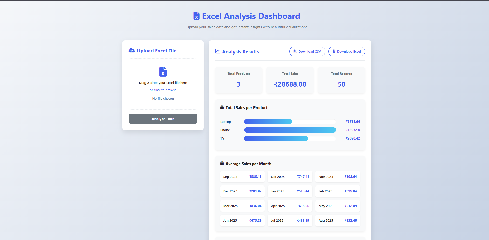

---




````markdown
# Sales Analyzer

A Django-based web application to upload sales data (Excel/CSV), analyze it, and download the analysis results.  
Designed for smooth data ingestion, dynamic column mapping, and detailed sales insights with downloadable reports.

---

## Features

- Upload sales data in `.xlsx` or `.csv` formats.
- Smart column mapping to handle variations in column names.
- Analyze total sales per product.
- Calculate average sales per month.
- Count total sales transactions per product.
- Download analysis results as CSV or Excel files.
- Auto-generate sample sales data for quick testing.
- Clean and responsive user interface.
- Upload logs to track file uploads and their statuses.

---

## Requirements

- Python 3.8+
- Django 4.x+
- pandas
- openpyxl (for Excel handling)

You can install dependencies with:

```bash
pip install -r requirements.txt
````

---

## Installation & Setup

1. Clone the repository:

   ```bash
   git clone <your-repo-url>
   cd sales_analysis
   ```

2. Create and activate a virtual environment (recommended):

   ```bash
   python -m venv env
   source env/bin/activate      # Linux/macOS
   .\env\Scripts\activate       # Windows
   ```

3. Install required Python packages:

   ```bash
   pip install -r requirements.txt
   ```

4. Apply migrations:

   ```bash
   python manage.py migrate
   ```

5. Run the development server:

   ```bash
   python manage.py runserver
   ```

6. Open your browser and go to: `http://127.0.0.1:8000/`

---

## Usage

* Upload your Excel (`.xlsx`) or CSV sales data file on the main page.
* View the analysis results instantly on the page.
* Download the analysis report as CSV or Excel using the provided buttons.
* Upload history and logs are stored in the database for reference.

---

## Generating Sample Data Files

To quickly generate sample sales data files for testing, run:

```bash
python analyzer/sample_Excel_create.py
```

This will create two files inside the `analyzer` directory:

* `sample_sales_data.xlsx` — Sample Excel file
* `sample_sales_data.csv` — Sample CSV file

Use these files to upload and explore the app’s features without manually creating datasets.

---

## Project Structure

```
sales_analysis/
│
├── analyzer/
│   ├── migrations/
│   ├── static/css/styles.css      # CSS styles for frontend
│   ├── templates/upload.html      # Main template
│   ├── sample_Excel_create.py     # Sample data generator
│   ├── forms.py                   # Django forms
│   ├── models.py                  # Django models
│   ├── urls.py                   # App URL routing
│   ├── views.py                  # Core views (upload, analysis, download)
│
├── sales_analysis/                # Project settings
│
├── env/                          # Virtual environment (optional)
├── db.sqlite3                    # SQLite DB file
├── manage.py                    # Django management script
├── requirements.txt             # Python dependencies
└── README.md                    # This file
```

---

## Notes

* This is a development project; do **not** use the Django development server in production.
* For production, configure a WSGI/ASGI server and secure settings.
* The app uses CSRF protection for secure form submissions.
* Smart column mapping helps prevent upload errors caused by inconsistent column names.

---

## License

This project is open-source and free to use under the MIT License.

---

## Author

Developed By
Sanket Majithiya, a Python developer with 1.5+ years of experience, focused on clean, maintainable code and
user-friendly UX.

---

If you have questions or want to contribute, feel free to open issues or pull requests!

```


